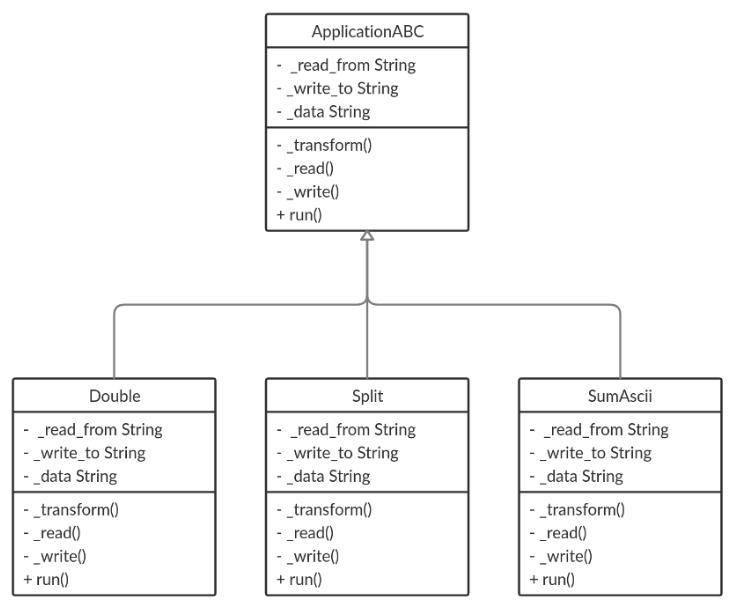

# transformator

## [OTUS](https://otus.ru) homework

### Goal
Implement OOP pattern **Template method**

### Description
The program reads a line from one file, transforms the line and writes it to another file.
Transformation depends on **transform type** which is entered by client.

### Class schema


### Template method
There is method **run** in abstract class **ApplicationABC**
```python
def run(self):
    self._read()
    self._transform()
    self._write()
```
Methods **_read** and **_write** are implemented in this class but **_transform** is abstractmethod
which should be implemented in child classes.

If child class implements **_transform** it can call **run** to read, transform and write a line! 
```python
# Split is a child class of ApplicationABC
app = Split(read_from='text.txt', write_to='result.txt')
app.run()
```

To run program:
```bash
$ python start.py
```

To run tests:
```bash
$ python -m unittest tests
```
